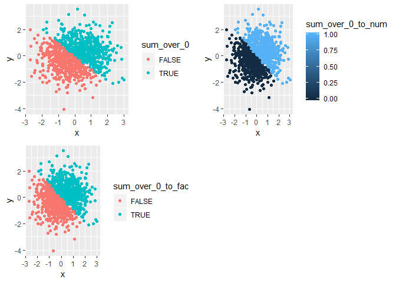

p8105\_hw1\_hx2264
================
Hongyao Xie
September 13, 2018

Problem 1
=========

``` r
# Load the library tidyverser
library(tidyverse)
```

    ## -- Attaching packages ---------------------- tidyverse 1.2.1 --

    ## v ggplot2 3.0.0     v purrr   0.2.5
    ## v tibble  1.4.2     v dplyr   0.7.6
    ## v tidyr   0.8.1     v stringr 1.3.1
    ## v readr   1.1.1     v forcats 0.3.0

    ## -- Conflicts ------------------------- tidyverse_conflicts() --
    ## x dplyr::filter() masks stats::filter()
    ## x dplyr::lag()    masks stats::lag()

``` r
# Set seed to get a reproducible random result
set.seed(1)

# Create the data frame
df_4_var = tibble(
  sample = runif(10, min = 0, max = 5),
  sample_over_2 = sample > 2,
  char = as.character(rep(c("a","b","c","d","f"),2)),
  fac = as.factor(rep(c("a","b","c","d","f"),2))
) 

# Run the data frame to see if it works
head(df_4_var)
```

    ## # A tibble: 6 x 4
    ##   sample sample_over_2 char  fac  
    ##    <dbl> <lgl>         <chr> <fct>
    ## 1   1.33 FALSE         a     a    
    ## 2   1.86 FALSE         b     b    
    ## 3   2.86 TRUE          c     c    
    ## 4   4.54 TRUE          d     d    
    ## 5   1.01 FALSE         f     f    
    ## 6   4.49 TRUE          a     a

``` r
# Take the mean of each variable
mean(df_4_var$sample)
```

    ## [1] 2.757569

``` r
mean(df_4_var$sample_over_2)
```

    ## [1] 0.6

``` r
mean(df_4_var$char)
```

    ## Warning in mean.default(df_4_var$char): argument is not numeric or logical:
    ## returning NA

    ## [1] NA

``` r
mean(df_4_var$fac)
```

    ## Warning in mean.default(df_4_var$fac): argument is not numeric or logical:
    ## returning NA

    ## [1] NA

The column 1 and 2 (random sample and logical vector) worked, whereas the column 3 and 4 (character vector and factor vector) didn't. Mean of the random sample was its arithmetic mean, and mean of the logical vector was to interpret TRUE as 1 and FALSE as 0. Both column 1 and 2 could be interpreted as numeric values, and thus we could calculate their mean.

The column 3 and 4 didn't work because character and factor could not be interpreted as numeric values here. Any words, like "hello" or "aaa" or "123", could be used in character vector and factor vector. Since the elements in these vectors were not always numbers, these two variable types didn't have mean.

``` r
# Applies as.numeric function
as.numeric(df_4_var$sample_over_2)
as.numeric(df_4_var$char)
```

    ## Warning: NAs introduced by coercion

``` r
as.numeric(df_4_var$fac)
```

The as.numeric function applied to logical and factor variables but the character variable. For the logical variable, as.numeric function returned 0 for FALSE and returned 1 for TRUE. For the factor variable, as.numeric returned an integer representation for each level of the factor variable. However, for the character variable, as.numeric wouldn't return any numeric values.

``` r
# Convert character variable from character to factor to numeric
char_to_fac <- as.factor(df_4_var$char)
char_to_fac_to_num <- as.numeric(char_to_fac)
char_to_fac_to_num
```

    ##  [1] 1 2 3 4 5 1 2 3 4 5

``` r
# Convert factor variable from factor to character to numeric
fac_to_char <- as.character(df_4_var$fac)
fac_to_char
```

    ##  [1] "a" "b" "c" "d" "f" "a" "b" "c" "d" "f"

``` r
fac_to_char_to_num <- as.numeric(fac_to_char)
```

    ## Warning: NAs introduced by coercion

``` r
fac_to_char_to_num
```

    ##  [1] NA NA NA NA NA NA NA NA NA NA

The character variable was successfully converted to a factor variable and then a numeric variable, whereas the factor variable was converted to a character variable but failed to be converted to a numeric variable subsequentially.

Problem 2
=========

``` r
# Create the data frame:
set.seed(2)

df_5_var = tibble(
  x = rnorm(1000),
  y = rnorm(1000),
  sum_over_0 = x + y > 0,
  sum_over_0_to_num = as.numeric(sum_over_0),
  sum_over_0_to_fac = as.factor(sum_over_0)
)

head(df_5_var)
```

    ## # A tibble: 6 x 5
    ##         x       y sum_over_0 sum_over_0_to_num sum_over_0_to_fac
    ##     <dbl>   <dbl> <lgl>                  <dbl> <fct>            
    ## 1 -0.897   0.466  FALSE                      0 FALSE            
    ## 2  0.185   0.955  TRUE                       1 TRUE             
    ## 3  1.59   -0.947  TRUE                       1 TRUE             
    ## 4 -1.13    0.0386 FALSE                      0 FALSE            
    ## 5 -0.0803 -0.831  FALSE                      0 FALSE            
    ## 6  0.132   0.557  TRUE                       1 TRUE

``` r
tail(df_5_var) # Check head and tail of the data frame in cause there is anything wrong
```

    ## # A tibble: 6 x 5
    ##        x     y sum_over_0 sum_over_0_to_num sum_over_0_to_fac
    ##    <dbl> <dbl> <lgl>                  <dbl> <fct>            
    ## 1  0.345 0.912 TRUE                       1 TRUE             
    ## 2  0.655 1.11  TRUE                       1 TRUE             
    ## 3 -1.68  0.148 FALSE                      0 FALSE            
    ## 4 -0.335 1.24  TRUE                       1 TRUE             
    ## 5 -0.171 0.926 TRUE                       1 TRUE             
    ## 6 -1.51  0.289 FALSE                      0 FALSE

There are "r dim(df\_5\_var)\[1\] " rows and "r dim(df\_5\_var)\[2\] " columns. The mean of x is "r mean(df\_5\_var)" and the median of x is "r mediam(df\_5\_var)". The proportion of cases for which the logical vector is TRUE is "r length(which(df\_5\_var*s**u**m*<sub>*o*</sub>*v**e**r*<sub>0</sub>))/*l**e**n**g**t**h*(*d**f*<sub>5<sub>*v*</sub></sub>*a**r*sum\_over\_0) \* 100%".

``` r
library(gridExtra)
```

    ## 
    ## Attaching package: 'gridExtra'

    ## The following object is masked from 'package:dplyr':
    ## 
    ##     combine

``` r
# Scatterplot of y vs x, color using the logical variable
scatter_by_logical <- ggplot(df_5_var, 
                             aes(x = x, y = y, color = sum_over_0)) + geom_point()
# Color scale: when x + y > 0, points were colored green; when x + y <= 0, points were colored red

ggsave("scatter_by_logical.png")
```

    ## Saving 7 x 5 in image

``` r
# Scatterplot of y vs x, color using the numeric variable
scatter_by_num <- ggplot(df_5_var, 
                         aes(x = x, y = y, color = sum_over_0_to_num)) + geom_point()
# Color scale: when x + y > 0, points were colored blue; when x + y <= 0, points were colored black

ggsave("scatter_by_num.png")
```

    ## Saving 7 x 5 in image

``` r
# Scatterplot of y vs x, color using the factor variable
scatter_by_fac <- ggplot(df_5_var, 
                         aes(x = x, y = y, color = sum_over_0_to_fac)) + geom_point()
# Color scale: when x + y > 0, points were colored green; when x + y <= 0, points were colored red

ggsave("scatter_by_fac.png")
```

    ## Saving 7 x 5 in image

``` r
# Combine multiple plots
grid.arrange(scatter_by_logical, scatter_by_num, scatter_by_fac, ncol = 2)
```


